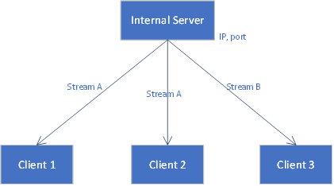
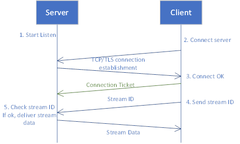

Internal Transport

# 1 Overview

Internal transport use client-server model.

An internal server for each process and one server can host multiple streams.

An internal client for each remote stream, client connects server to receive stream data.

The internal connection can be TCP/TLS/QUIC.

# 2 Workflow

(Certificate to verify client)

Drop data policy:

1.  Drop non-key frame data for video.

2.  Drop low level data for audio.

3.  Drop oldest data.

4.  Other customized policy based on media information.

# 3 Data format

The transport message over internal connection is in following format:

| 4 bytes (payload length K) | K bytes (payload data) |

Payload data = | 1 byte (message type) | (k – 1 ) bytes format data |

The “message type” can be: (protobuf)

1.  Feedback (client to server)

2.  MediaFrame (server to client)

3.  MetaData (server to client)

The payload format of each type can be referred from MediaFramePipeline.cpp.

Feedback – class FeedbackMsg

MediaFrame – class Frame

MetaData – class MetaData

# 4 Control layer

## 4.1 Spread call

Every stream has an internal address of server (ip, port).

For each agent process, there’re local and remote streams like client
SDK.

`Local stream`: stream which is created on local process.

`Remote stream`: stream which is spread from other nodes through
internal connection.

If we want to spread a stream to local, only internal address (ip, port) of that stream is needed.

RPC calls for spreading:

Conference node –(linkup with stream address)–> Target node (do spread and linkup)

Linkup call:
RPC linkup(
    targetId, /* linkup destination, like webrtc subscription Id */
    from = { /* linkup source */
        type /* audio, video... */: {id, ip, port} /* remote stream description */
    },
)

## 4.2 Lifetime

A `TransportServer` lives during the `workingNode` process.

A `TransportClient` is created for a `Remote stream`, is destroyed
by disconnect event or close call.
