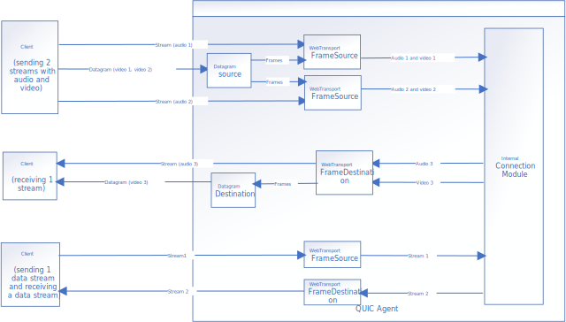

# QUIC agent

## Overview
QUIC agents are designed for [WebTransport](https://w3c.github.io/webtransport/) over HTTP/3 connections. A WebTransport connection could send and receive arbitrary data, as well as media data encoded or can be decoded by [WebCodecs](https://www.w3.org/TR/webcodecs/).

## Architecture and dataflow



A WebTransportFrameSource handles all audio and video frames for a publication. A WebTransportFrameDestination dispatches audio and video frames to different WebTransport streams or a datagram sender.

A DatagramSource processes datagrams (RTP packets) received from client side, depacketizes them to create audio or video frames, and dispatches media frames to a WebTransportFrameSource. It also handles FEC and NACK, similar to RTCRtpReceiver in WebRTC. A DatagramDestination is similar to RTCRtpSender.

## WebTransport payload and message format

This section defines the payload and message format for data transmitted over WebTransport.

### Streams

Both server and client can initialize a stream. When a stream is created, initial side sends a session ID, which is a 128 bit length message to the remote side. Session ID could be a publication ID or subscription ID as defined in [Client-Portal Protocol](https://github.com/open-webrtc-toolkit/owt-server/blob/master/doc/Client-Portal%20Protocol.md). As the session ID issued by server may less than 128 bit right now, fill it with 0 in most significant bits. Session ID 0 is reserved for signaling. When remote side receives the session ID, it should check whether session ID is valid. Terminate the stream if session ID is invalid, or send the same session ID to client if it is valid. Depends on the type of stream it created, one side or both sides are ready to send data.

### Datagram

Each package has a 128 bit header for session ID.

```
    0                   1                   2                   3
    0 1 2 3 4 5 6 7 8 9 0 1 2 3 4 5 6 7 8 9 0 1 2 3 4 5 6 7 8 9 0 1
   +-+-+-+-+-+-+-+-+-+-+-+-+-+-+-+-+-+-+-+-+-+-+-+-+-+-+-+-+-+-+-+-+
   |                                                               |
   |                      Session Identifier                       |
   |                             ....                              |
   |                                                               |
   +-+-+-+-+-+-+-+-+-+-+-+-+-+-+-+-+-+-+-+-+-+-+-+-+-+-+-+-+-+-+-+-+
   |                      Datagram Data (*)                      ...
   +-+-+-+-+-+-+-+-+-+-+-+-+-+-+-+-+-+-+-+-+-+-+-+-+-+-+-+-+-+-+-+-+
```

It may increase about 2% network cost.

### Signaling Session

After creating a WebTransport, a stream with session 0 should be created for authentication and signaling. Every signaling message is followed by a 32 bit length integer that indicates the body's length.

```
    0                   1                   2                   3
    0 1 2 3 4 5 6 7 8 9 0 1 2 3 4 5 6 7 8 9 0 1 2 3 4 5 6 7 8 9 0 1
   +-+-+-+-+-+-+-+-+-+-+-+-+-+-+-+-+-+-+-+-+-+-+-+-+-+-+-+-+-+-+-+-+
   |                      Message length                           |
   +-+-+-+-+-+-+-+-+-+-+-+-+-+-+-+-+-+-+-+-+-+-+-+-+-+-+-+-+-+-+-+-+
   |                          Message                            ...
   +-+-+-+-+-+-+-+-+-+-+-+-+-+-+-+-+-+-+-+-+-+-+-+-+-+-+-+-+-+-+-+-+
```

### Media Stream

After sending 128 bit length session ID, a 128 bit length track ID is sent to remote side to indicates the track of a stream. Since audio track and video track of a single stream shares the same track ID at this time, track 1 is for audio and track 2 is for video.

When a WebTransport stream is used for transmitting data of a media stream track (e.g.: H.264 bitstream), a 32 (8+24) bit length header is added to indicate frame size.

```
    0                   1                   2                   3
    0 1 2 3 4 5 6 7 8 9 0 1 2 3 4 5 6 7 8 9 0 1 2 3 4 5 6 7 8 9 0 1
   +-+-+-+-+-+-+-+-+-+-+-+-+-+-+-+-+-+-+-+-+-+-+-+-+-+-+-+-+-+-+-+-+
   |     Reserved    |               Message length                |
   +-+-+-+-+-+-+-+-+-+-+-+-+-+-+-+-+-+-+-+-+-+-+-+-+-+-+-+-+-+-+-+-+
   |                          Message                            ...
   +-+-+-+-+-+-+-+-+-+-+-+-+-+-+-+-+-+-+-+-+-+-+-+-+-+-+-+-+-+-+-+-+
```

### Authentication

If signaling messages are transmitted over WebTransport, authentication follows the regular process defined by [Client-Portal Protocol](https://github.com/open-webrtc-toolkit/owt-server/blob/master/doc/Client-Portal%20Protocol.md). Otherwise, client sends a token for WebTransport as a signaling message. WebTransport token is issued during joining a conference. If the token is valid, server sends a 128 bit length zeros to client.

## Build conference server with QUIC agent

Because we don't have a good place to store pre-built QUIC SDK for public access, QUIC agent is not enabled by default. Additional flags are required to enable QUIC agent.

1. Download QUIC SDK from the URL specified [here](https://github.com/open-webrtc-toolkit/owt-server/blob/master/source/agent/addons/quic/quic_sdk_url). QUIC SDK is hosted on GitHub as an artifact. You will need to follow [this description](https://docs.github.com/en/rest/reference/actions#download-an-artifact) to make a REST request to GitHub. Or you can download the latest QUIC SDK from [GitHub Actions](https://github.com/open-webrtc-toolkit/owt-sdk-quic/actions) tab. Commits pushed to main branch have artifact for downloading.
1. After running `installDeps.sh`, put headers to build/libdeps/build/include, and put libraries(.so file) to build/libdeps/build/lib.
1. Append `-t quic` to the arguments for build.js.
1. Append `-t quic-agent` to the arguments for pack.js.

## Certificate for QUIC

OWT Conference Server is using a self-signed certificate during development phase, which would be only valid for 14 days. You can use a CA-signed certificate to avoid refreshing the certificate periodically. A CA-signed certificate is recommended for production environment. WebTransport connection will fail if certificate is not valid or expires.

### Certificates signed by a trusted CA

- Copy your PKCS12 format certificate to `quic_agent/cert/` directory to replace the one there.
- Restart Conference Server QUIC agent to apply the change. 
- Don't provide any fingerprint in client applications.

### Generate self-signed certificates

#### Precondition
- Make sure you are running the tool under Linux and,
- Openssl tool is correctly setup in your system.
- Download the tool under chromium/src/net/tools/quic/certs/ from chromium project ([v98.0.4694.2](https://chromium.googlesource.com/chromium/src/+archive/refs/tags/93.0.4575.1/net/tools/quic/certs.tar.gz.)) to local directory named `tool`. This contains three files: `ca.cnf`, `generate-certs.sh` and `leaf.cnf`.
- Because WebTransport custom certificate verification doesn't support RSA, please modify the script to use ECDSA. You may refer to [this script](../../source/agent/addons/quic/test/scripts/generate-certs.sh) for testing.

#### Certificate Generation

- Modify leaf.cnf, adding an entry into `other_hosts` section.
- Make sure generate-certs.sh is executable. If not, run `chmod +x generate-certs.sh`;
- Remove the `out` dir in case it exists.
- Under the downloaded tool dir, run `./generate-certs.sh`. It is expected to generate a series of files under out dir.
- Under the downloaded tool dir, run `openssl pkcs12 -inkey out/leaf_cert.key -in out/leaf_cert.pem -export -out out/certificate.pfx`. This will prompt for password for the pfx. Please type the certificate password of your conference server. The default password is `abc123`.
- Under the downloaded tool dir, run `openssl x509 -noout -fingerprint -sha256 -inform pem -in out/leaf_cert.pem`. You will get the fingerprint string in the form of "XX:XX:XX....XX:XX".

#### Use the Certificate

- Copy the generated certificate.pfx under `out` dir to `quic_agent/cert/` dir to replace the one there.
- Restart Conference Server QUIC agent to apply the change.
- If you're using JavaScript sample for QUIC, make sure you also update JS sample with the new fingerprint.
- In your native client sample, make sure you include the fingerprint of new cert in the `ConferenceClientConfiguration.trusted_quic_certificate_fingerprints` you passed to `ConferenceClient` ctor. See more details in the conference sample.
