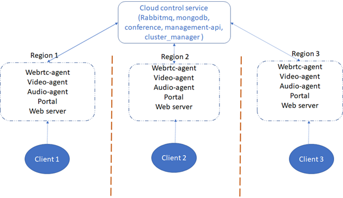
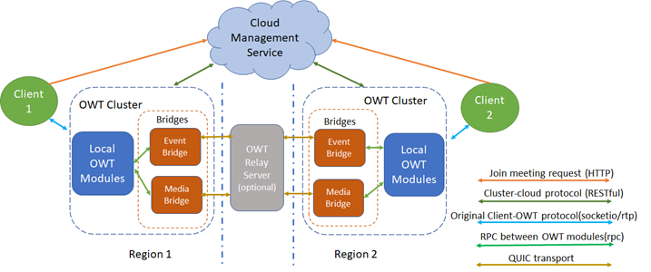
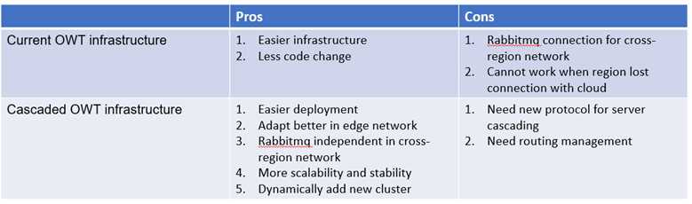
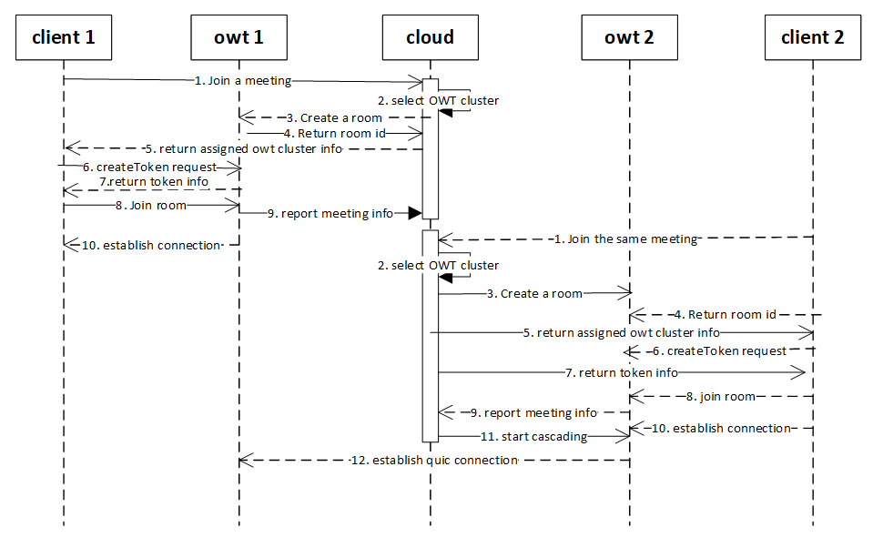
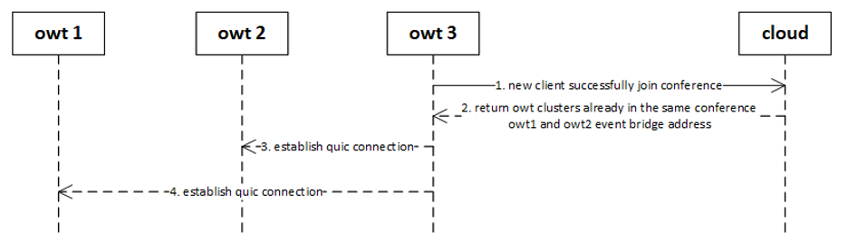
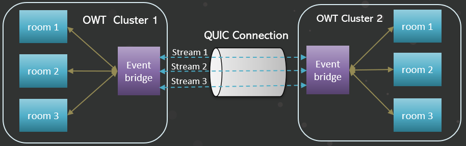
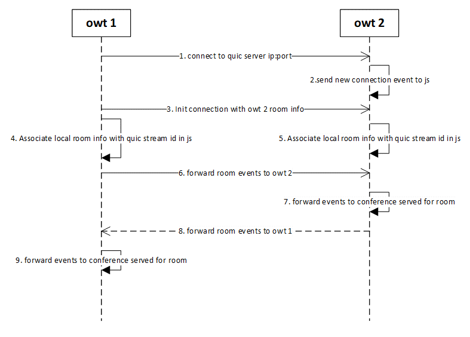
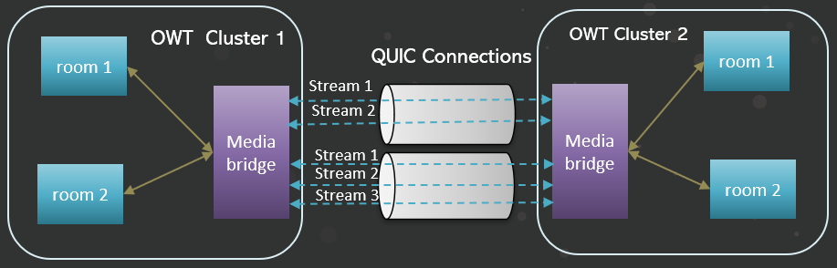
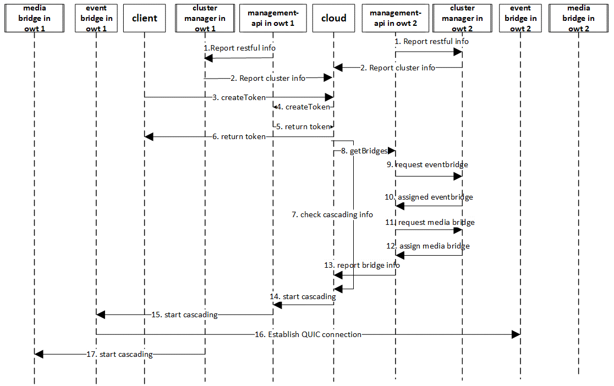

# OWT cascading design

## Overview

In real practice, users in a conference room may locate in different cities, countries, or continents. We can deploy one OWT cluster for the conference, and add different modules for each region as following diagram shows:
  

With this deployment, Rabbitmq will be in the cloud and other region-based modules will connect to cloud Rabbitmq service in the cloud. Rabbitmq will handle cross region rpc request and will introduce more unstable situations. And once the region network disconnects with cloud, modules in work-disconnected region cannot work independently. So, we consider using OWT cascading for the large and cross region deployment. Here is the overall view:
 
    
With this deployment, each region will deploy a separate OWT cluster. It’s easier for large deployment and the internal OWT cluster will work independently when region network disconnects with cloud. Here is a comparison for these 2 deployments:
 
 
We will focus on OWT cascading design here.

## Cloud Management service

Cloud management service is deployed in a cloud for central management, it should implement following features:
  - Accept and record OWT cluster register info
  - Accept client request and assign OWT cluster to client
  -	Record conference info and trigger OWT cluster cascading
  - Maintain OWT cluster info and conference info

### OWT cluster register

OWT will register cluster info to cloud management service when the cluster is launched. This cluster registration work will be done in clusterManager. clusterManager will send the register requests to cloud after it gets service key/id info from management_api

```
  object(clusterInfo) {
    id:  string,                               // name of the OWT cluster
    region: string,                       // region of the OWT cluster
    restfulip: string,                    // OWT restful server ip ?
    restfulport: string ,              //OWT restful server port ?
    eventbridgeip: string,           // OWT event bridge listener ip
    eventbridgeport: string,       // OWT event bridge listener port
    mediabridgeip: string,          // OWT media bridge listener ip
    mediabridgeport: string       //OWT media bridge listener port
  }
```

OWT cluster manager will update capacity info to cloud if a new purpose agent joins the cluster or no such purpose agent lives in the cluster.

```
  Object (capacityinfo) {
    action: string,        //actions: add, delete
    module: string      //OWT modules: webrtc, streaming, video, audio… 
  }
```

OWT cluster manager will report room token to cloud for event/media bridge QUIC server to validate QUIC client connection. The token will be generated when room is initialized.

```
  object (tokeninfo) {
    room: string                     // conference room id
    token: string                    // conference room token
  }
```

### Handle client request

Client will send a join conference request to cloud management service:
Request body:

type       | content
-------------|-----
json       | conferenceInfo

```
  object(conferenceInfo) {
    id: conferenceId,
    type: conferenceType
  }
```

Response body:

type       | content
-------------|-----
json       | clusterInfo

```
  object(clusterInfo) {
    ip: ip,   //OWT cluster web server ip
    port: port, //OWT cluster web server port
    room:  roomId   //OWT cluster room id
  }
```

### Create room request

Cloud management service will check saved conference info list to see if room has been created for this conference id in the owt cluster, if not, cloud management service will send create room request to owt cluster with room configuration according to client conference type, owt cluster will response with created room info. 
Users can define several conference templates which includes different room configurations, such as publication limit, SFU only. etc, so client can join specific kinds of room by specifying conference type. If no conference type is specified, then client will be assigned with the default room configuration template.

```
  object(conference) {
    id: conferenceId,
    cluster: [object(cluster)]
  }
  object(cluster) {
    id: clusterId,
    room: roomId
  }
```

### Trigger OWT cascading

Here is the workflow for OWT cascading trigger:
 
In step 3, cloud management service will send a create room request with room configuration to ensure that different rooms in different OWT clusters serving for one conference will share the same room configuration. When getting a new client joining conference request and assigning owt cluster to client, cloud management service will trigger cascading if there are other OWT clusters in the same conferencing after getting the new client successfully joined room message from the assigned OWT cluster. 
If cascading is needed, cloud will send a request to owt1 to get the event/media bridge info, owt1 will schedule an event/media bridge and return related info to cloud:
Request body:

type	     | content
-------------|-----
json|getBridgeInfo


In real practice, the cascading trigger policy should be different based on different scenarios, users should customize this schedule policy in their deployment.
Cascading request (from cloud management service to OWT cluster)
Request body:

  type       | content
---------|------
json|cascading

```
  object(cascading) {
    connectip: ip,        //quic server ip address of owt cluster to connect
    connectport: port,   // quic server port of owt cluster to connect
    room:  roomId,    // room id of owt cluster to connect
  }
```


 
## Event bridge

### Overall process

 

For event cascading, each cluster will setup a quic session with another OWT, that means one quic session will represent one cascading connection between 2 OWT clusters. All the events in cluster rooms will be sent to another cluster through this quic session. Each conference in cascaded cluster will associate with a quic stream.  
Event bridge signaling process is listed:

 

For event bridge, the earlier joined cluster event bridge will work as quic server, and the later joined cluster event bridge will work as quic client and connect to previous joined cluster event bridge. Inside the OWT cluster, room id will be associated with related quic stream id, so every time when new data comes from quic stream, event bridge will check associated room id with this quic stream id and forward coming cascaded event data to specific conference node. Then the event cascading process between clusters will work properly.

### Forwarded events

Following event in conference will be forwarded to other OWT cluster when cascading establishes:

Type       |   description       |	Conference API
-------------|--------------|--------------
join|Participant join event|addParticipant
leave|Participant leave event|removeParticipant
add|Webrtc/quic forward stream added event|addStream
add|Non-webrtc forward stream added event|addStream
update|Stream info update event|updateStreamInfo
remove|Remove stream event|removeStream
update|Stream mute/unmute status update|setStreamMute
initialize|Initialize stream and participant info to cascaded owt cluster|sonNewClusterCascaded

If owt cluster 2 successfully establishes QUIC connection with owt cluster 1, owt cluster 1 will send “initialize” event including all the room objects to owt cluster 2, then in owt cluster 2 event bridge, bridge will parse the message and simulate participant streams actions to owt cluster 2 conference node.

### QUIC streams:

QUIC client will create a bidirectional stream after successfully establishing QUIC connection with QUIC server. QUIC client will associate the created stream id with conference rpcId where startCascading event is from. QUIC client will then send the remote room info to server, server will bind the stream id with roomid retrieved from stream data. 
When a conference node in the cluster exits, event bridge will check the QUIC stream associated with it and terminate the stream.

## Media bridge

Overall process:

 

Media bridge will be used to transfer media streams between 2 OWT clusters. One QUIC connection will be established for each room in the cluster, and each OWT forward stream will be send through QUIC stream. For WebRTC stream, audio and video track of the same OWT forward stream will be sent out separately in different QUIC stream.
Each media bridge node will be launched as QUIC server listening at the configured port. If the bridge gets a startCascading request, it will work as QUIC client and proactively establish QUIC connection with the QUIC server in another OWT cluster. A QUIC stream for signaling purpose will be created to exchange cluster info and make sure QUIC connection is ready to work for both sides. Here is a workflow for the initial QUIC connection establish process:

 

## Build OWT server with cascading bridges

Because we don't have a good place to store pre-built QUIC SDK for public access, media/event bridge is not enabled by default. Additional flags are required to enable media/event bridge.
1.	Follow QUIC SDK  to generate the QUIC SDK library.
2.	Put  to build/libdeps/build/include, and generated libraries(.so file) in above step to build/libdeps/build/lib.
3.	Append `-t quicCascading` to the arguments for build.js.
4.	Append `-t media-bridge/event-bridge` to the arguments for pack.js.

## How to configure cascading clusters

### Cloud control sample

We provide a simple cascading control sample in owt-server/source/cascading_sample folder, this is a reference sample for cascading control, in this sample, a simple web server will be launched to do following things:

API       | Usage
---------|------
createConference|Create a conference ID 
createToken|Token used to validate participant
registerCluster|OWT cluster register info to cloud control when cluster starts to work
updateCapacity|OWT cluster update capacity (supported modules) to cloud control, this info can be used to do further scheduling according to cluster capacity
updateConference|OWT cluster update conference token info to cloud control for quic client connection validation
leaveConference|OWT cluster report conference leave info to cloud control when related conference room is destroyed
unregisterCluster|OWT cluster unregister info to cloud control when cluster stops working

cloud control sample can be deployed on a separate environment when following steps:

```
cd cascading_sample
npm install
node .

```

This is just a sample to show how cascading clusters control work, please customize your own scheduling and secured deployment in real practice.

### ManagementAPI configuration

management_api module will report restful server info to cluster manager and then report to cloud control, so that cloud control could communicate with cluster management_api for restful API, please configure following items in cascading item in ```management_api/management_api.toml```:

````
[cascading]
enabled: set true to enable cascading feature, disable cascading by default
servicename: service name used to register to cascading cloud for accessing to communicate with this cluster
````

### ClusterManager configuration

The OWT cluster will report cluster info to cloud control service through cluster_manager module in OWT, you need to configure following items in cascading item in ```cluster_manager/cluster_manager.toml``` file before starting it:

````
[cascading]
enabled: set true to enable cascading feature, disable cascading by default
url: specify the cloud control url, so that cluster manager module can connect to the url and send cluster info
region: specify the region this OWT cluster locate, this will be used by cloud control service to schedule incoming clients by region
clusterID: specify a unique cluster ID for this cluster in the cloud.
````

### Conference configuration

conference events will be sent to cascaded clusters through ```conference_agent``` and eventbridge, configure following item in cascading item in ```conference_agent/agent.toml``` to enable event cascading:

````
[cascading]
enabled: set true to enable cascading feature, disable cascading by default
````


### Media/event bridge

Configure QUIC server listen address or hostname with valid ip address or hostname in agent.toml in media_bridge and eventbridge folder, if self-signed certificate is used, please make sure address or hostname is added in leaf.cnf before generating self-signed certificate file. Specify certificate file location in `keystorePath`

````
[bridge]
# Key store path doesn't work right now.
keystorePath = "./cert/certificate.pfx"

# ip address/hostname of QUIC server for media cascading is going to listen on. 
ip_address = '' #default: ""
hostname = "" #default: ""

````

## Certificate for QUIC

OWT Conference Server is using a self-signed certificate during development phase, which would be only valid for 14 days. You can use a CA-signed certificate to avoid refreshing the certificate periodically. A CA-signed certificate is recommended for production environment. WebTransport connection will fail if certificate is not valid or expires.

### Certificates signed by a trusted CA

- Copy your PKCS12 format certificate to `media_bridge/cert/` and `eventbridge/cert/` directory to replace the one there.
- Restart Conference Server media_bridge/eventbridge agent to apply the change. 
- Don't provide any fingerprint in client applications.

### Generate self-signed certificates

#### Precondition
- Make sure you are running the tool under Linux and,
- Openssl tool is correctly setup in your system.
- Download the tool under chromium/src/net/tools/quic/certs/ from chromium project ([109.0.5414.67](https://chromium.googlesource.com/chromium/src/+archive/refs/tags/109.0.5414.67/net/tools/quic/certs.tar.gz.)) to local directory named `tool`. This contains three files: `ca.cnf`, `generate-certs.sh` and `leaf.cnf`.
- Because WebTransport custom certificate verification doesn't support RSA, please modify the script to use ECDSA. You may refer to [this script](../../source/agent/addons/quic/test/scripts/generate-certs.sh) for testing.

#### Certificate Generation

- Modify leaf.cnf, adding an entry into `other_hosts` section.
- Make sure generate-certs.sh is executable. If not, run `chmod +x generate-certs.sh`;
- Remove the `out` dir in case it exists.
- Under the downloaded tool dir, run `./generate-certs.sh`. It is expected to generate a series of files under out dir.
- Under the downloaded tool dir, run `openssl pkcs12 -inkey out/leaf_cert.key -in out/leaf_cert.pem -export -out out/certificate.pfx`. This will prompt for password for the pfx. Please type the certificate password of your conference server. The default password is `abc123`.
- Under the downloaded tool dir, run `openssl x509 -noout -fingerprint -sha256 -inform pem -in out/leaf_cert.pem`. You will get the fingerprint string in the form of "XX:XX:XX....XX:XX".

#### Use the Certificate

- Copy the generated certificate.pfx under `out` dir to `media_bridge/cert/` and `eventbridge/cert/` dir to replace the one there.
- In the terminal environment where media_bridge/eventbridge agents run, make sure you export the fingerprint of new cert through variable `export QUIC_SERVER_FINGERPRINTS=XX:XX:XX....XX:XX`.
- Restart Conference Server media_bridge/eventbridge agent to apply the change.


