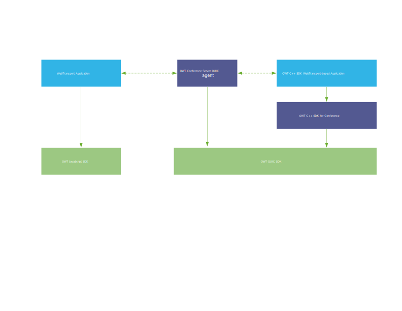
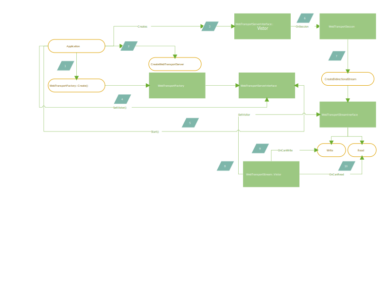
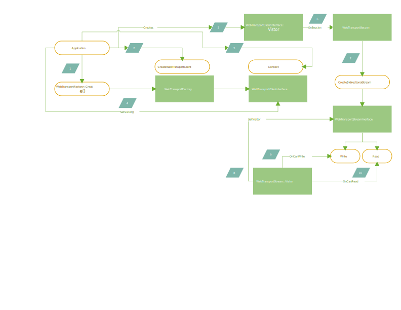

| OWT QUIC Programming Guide |

# Overview

OWT QUIC SDK and Client SDKs provides the APIs for enabling WebTransport over HTTP/3 for reliable data transmission with OWT Conference Server.

OWT conference server and C++ SDK only support WebTransport over HTTP/3. We don't have a plan to support WebTransport over other protocols.

# Scope

This document describes the programming models and API interfaces for following usage scenarios.

- Deploying a conference server that is capable of forwarding data over WebTransport.
- Implementing client application that is capable of sending data to QUIC server or receiving data from it.

Description of the details of WebTransport is outside the scope of this document.

# Related Repositories

Below are the repo locations of current SDK and server implementations:

- OWT QUIC SDK: [https://github.com/open-webrtc-toolkit/owt-sdk-quic](https://github.com/open-webrtc-toolkit/owt-sdk-quic) This is the C++ implementation of Server-side and Client-side SDK, and is the base of enabling QUIC agent on server, and QUIC conference SDK on client.
- OWT Conference server: [https://github.com/open-webrtc-toolkit/owt-server](https://github.com/open-webrtc-toolkit/owt-server/pull/113). This is the server repo that supports forwarding of QUIC streams.
- OWT JavaScript SDK: [https://github.com/open-webrtc-toolkit/owt-client-javascript](https://github.com/open-webrtc-toolkit/owt-client-javascript) This is the repo for enabling QUIC client on browser.
- OWT Native SDK: [https://github.com/open-webrtc-toolkit/owt-client-native](https://github.com/open-webrtc-toolkit/owt-client-native) This is the client SDK repo for enabling QUIC support using OWT conferencing API.

# Architecture

The topology of components is shown in below diagram:

There are a few components involved and their relationships with streaming using WebTransport are described as below:

## OWT QUIC SDK

This is the foundation of WebTransport implementation in OWT. It provides the APIs to create WebTransport over HTTP/3 clients and server forming a C/S architecture. Basically you can directly build your WebTransport applications using the QUIC SDK client API if you're not using the OWT native SDK.

## OWT Native SDK for Conference

The OWT conference SDK built upon OWT QUIC SDK client API. It is used in combination with OWT QUIC conference server when you rely on OWT signaling protocol for WebTransport connection setup as well as stream forwarding.

## OWT QUIC Conference Server

The OWT QUIC conference server implements the signaling protocol for WebTransport connection setup, as well as QUIC stream forwarding.

## OWT QUIC JavaScript SDK

Used together with OWT QUIC conference server, to build Web-based QUIC applications. Useful when the QUIC streaming application is implemented using Web API.

# How to build OWT QUIC SDK

Please follow [OWT QUIC SDK build instruction](https://github.com/open-webrtc-toolkit/owt-sdk-quic/blob/master/quic_transport/docs/build_instructions.md) to build the SDK.

# OWT QUIC SDK API

In this section we provide a detailed description of the APIs provided by OWT QUIC SDK.

## OWT QUIC SDK Server API Calling Flow

The server API calling flow is shown in below diagram and table.

| Step # | API calling flow |
| --- | --- |
| 1 | Application calls the factory method of WebTransportFactory::Create() to get an instance of WebTransportFactory |
| 2 | Application calls WebTransportFactory::CreateWebTransportServer() on the WebTransportFactory instance got in step #1, specifying the server port, certificate path either in the form of .pkcs12 or .pfx format. |
| 3 | Application Creates the Visitor instance of WebTransportServerInterface |
| 4 | Application calls SetVisitor on the WebTransportServerInterface instance got in step #2. |
| 5 | Application calls Start() method on the WebTransportServerInterface instance got in step #2 |
| 6 | OnSession() callback will be invoked once the WebTransportserver gets a connection request from client, and an WebTransportSession instance is passed from the callback. |
| 7 | Application calls CreateBidirectionalStream on the WebTransportSession got in step 6 and get a WebTransportStreamInterface instance. |
| 8 | Application creates WebTransportStream::Visitor instance and invokes WebTransportStreamInterface::SetVisitor(). |
| 9 | Application reads the WebTransportStream when OnCanRead is invoked on the WebTransportStream::Visitor; or write to the WebTransportStream when OnCanWrite is invoked on the WebTransportStreamVisitor; |

## OWT QUIC SDK Client API Calling Flow

The client API calling flow is shown in below diagram and table. It's similar as the server side calling flow except the WebTransportFactory creates a WebTransportClientInterface, instead of a WebTransportServerInterface, and client needs to call Connect() instead of Start() to get a WebTransportSession.

| Step # | API calling flow |
| --- | --- |
| 1 | Application calls the factory method of WebTransportFactory::Create() to get an instance of WebTransportFactory |
| 2 | Application calls WebTransportFactory::CreateWebTransportClient() on the WebTransportFactory instance got in step #1, specifying the server URL to connect to. |
| 3 | Application Creates the Visitor instance of WebTransportClientInterface |
| 4 | Application calls SetVisitor on the WebTransportClientInterface instance got in step #2. |
| 5 | Application calls Connect() method on the WebTransportClientInterface instance got in step #2, passing the URL of the server. |
| 6 | OnSession() callback will be invoked once the WebTransportclient successfully connects to server, and an WebTransportSession instance is passed from the callback. |
| 7 | Application calls CreateBidirectionalStream on the WebTransportSession got in step 6 and get a WebTransportStreamInterface instance. |
| 8 | Application creates WebTransportStream::Visitor instance and invokes WebTransportStreamInterface::SetVisitor(). |
| 9 | Application reads the WebTransportStream when OnCanRead is invoked on the WebTransportStream::Visitor; or write to the WebTransportStream when OnCanWrite is invoked on the WebTransportStreamVisitor; |

## Details of Callbacks and Data Structures of QUIC SDK

Please refer to [QUIC SDK APIs](https://github.com/open-webrtc-toolkit/owt-sdk-quic/tree/main/web_transport/sdk/api/) for the detailed API list and document.

## Samples of QUIC SDK

Please refer to [QUIC SDK sample](https://github.com/open-webrtc-toolkit/owt-sdk-quic/blob/main/web_transport/sdk/impl/tests/web_transport_owt_end_to_end_test.cc) on how to use the server and client APIs.

# OWT Native Conference SDK

Please refer to latest [Native SDK build instructions](https://github.com/open-webrtc-toolkit/owt-client-native/blob/master/README.md) to build OWT natvie conference SDK for both Windows and Linux.

# OWT Native Conferene SDK API

OWT conference SDK provides a series of API for wrapping the underlying QUIC SDK to communicate with the OWT conference server.

Typical calling flow for publishing QUIC stream:

Typical calling flow for Subscribing QUIC stream:

Please see the conference sample application for more detailed usage.

# OWT QUIC Conference Server

Please follow [Conference Server build instructions](https://github.com/open-webrtc-toolkit/owt-server/blob/master/README.md) on how to build and deploy the conference server.

## How to use Pre-built Conference Server Binary

Steps to run Conference Server with pre-built binary:

1. Go to the untarred conference server dir, and run `./bin/init-all.sh --deps`; this would try to install mongodb and rabbitmq-server. Don't set any password for rabbitmq or mongodb.
1. Still in the same dir, run `bin/init-all.sh`.
1. Update quic_agent/agent.toml, set `hostname` to the hostname quic agent is running on.
1. Update management_api/management_api.toml, set `enableWebTransport` to `true`.
1. run `bin/start-all.sh`.
1. Open [https://localhost:3004/quic.html](https://localhost:3004/quic.html) on the same host with Chrome browser to visit the web sample page. Due to the test certificate, you may need confirm this unsafe access.
1. Press 'Start Sending' button to start transferring data to conference server. Press 'Stop Sending' button on the web page to stop sending.. If there's no error in the console, that implies server is correctly setup.

# OWT QUIC Windows Sample

The Windows sample will be provided in OWT repo separately. More details will be provided later.