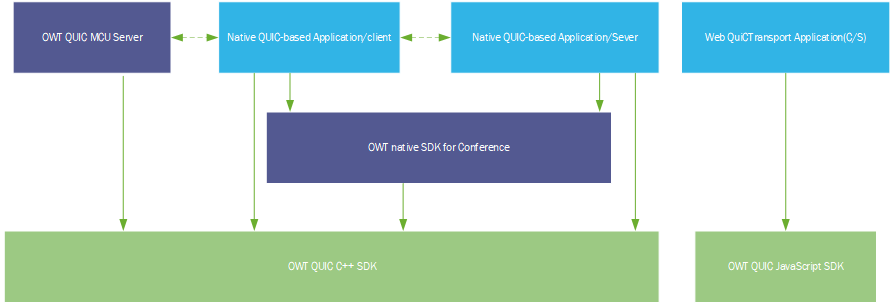
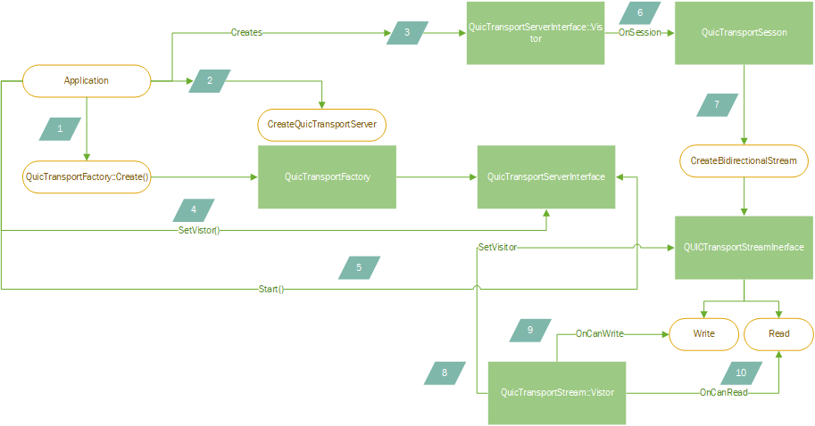
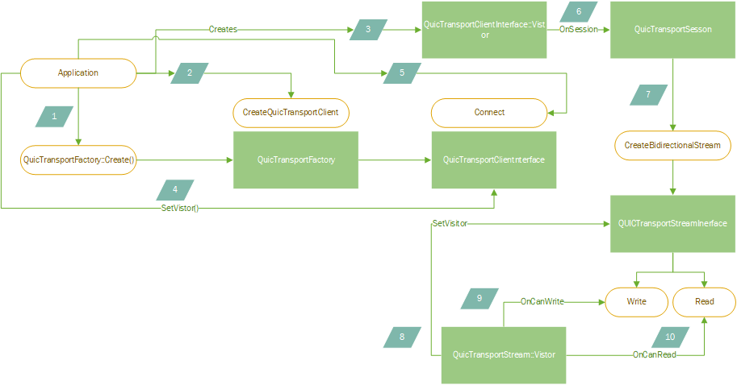
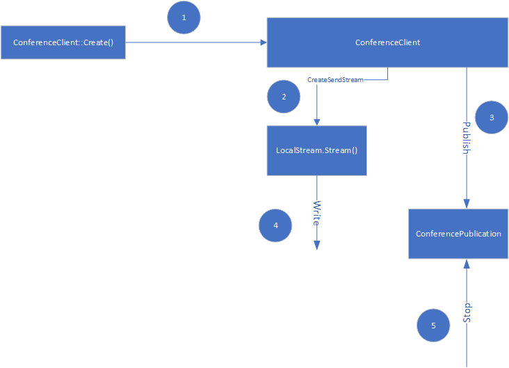
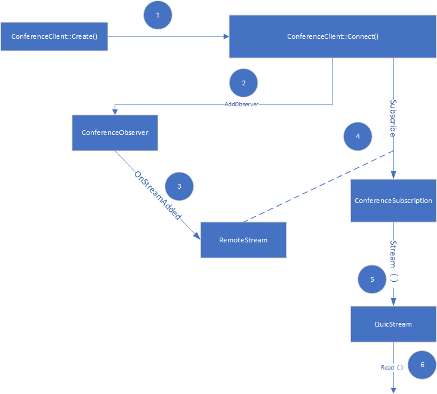

| OWT QUIC Programming Guide |

# Overview

OWT QUIC SDK and Client SDKs provides the APIs for enabling QUIC Transport for reliable data transmission over QUIC protocol with OWT Conference Server.

# Scope

This document describes the programming models and API interfaces for following usage scenarios.

- Deploying a QUIC conference server that is capable of forwarding data over QUIC channel.
- Implementing client application that is capable of sending data to QUIC server or receiving data from it.

Description of the details of QUIC transport is outside the scope of this document.

# Related Repos

Below are the repo locations of current SDK and server implementations:

- OWT QUIC C++ SDK: [https://github.com/open-webrtc-toolkit/owt-deps-quic](https://github.com/open-webrtc-toolkit/owt-sdk-quic) This is the C++ implementation of Server-side and Client-side SDK, and is the base of enabling QUIC agent on server, and QUIC conference SDK on client.
- OWT Conference server: [https://github.com/open-webrtc-toolkit/owt-server](https://github.com/open-webrtc-toolkit/owt-server/pull/113). This is the server repo that supports forwarding of QUIC streams.
- OWT JavaScript SDK: [https://github.com/open-webrtc-toolkit/owt-client-javascript](https://github.com/open-webrtc-toolkit/owt-client-javascript) This is the repo for enabling QUIC client on browser.
- OWT Native SDK: [https://github.com/open-webrtc-toolkit/owt-client-native](https://github.com/open-webrtc-toolkit/owt-client-native) This is the client SDK repo for enabling QUIC support using OWT conferencing API.

# Architecture

The topology of components is shown in below diagram:

There are a few components involved and their relationships with streaming using QuicTransport are described as below:

## OWT QUIC C++ SDK

This is the foundation of QUIC implementation in OWT. It provides the APIs to create QUIC transport clients and server forming a C/S architecture. Basically you can directly build your QUICTransport applications using the QUIC C++ SDK client API if you're not using the OWT native SDK.

## OWT Native SDK for Conference

The OWT conference SDK built upon OWT QUIC C++ SDK client API. It is used in combination with OWT QUIC conference server when you rely on OWT signaling protocol for QUIC connection setup as well as stream forwarding.

## OWT QUIC Conference Server

The OWT QUIC conference server implements the signaling protocol for QUIC connection setup, as well as QUIC stream forwarding.

## OWT QUIC JavaScript SDK

Used together with OWT QUIC conference server, to build Web-based QUIC applications. Useful when the QUIC streaming application is implemented using Web API.

# How to build OWT QUIC C++ SDK

Please follow [OWT QUIC C++ SDK build instruction](https://github.com/open-webrtc-toolkit/owt-deps-quic/blob/master/quic_transport/docs/build_instructions.md) to build the SDK.

# OWT QUIC C++ SDK API

In this section we provide a detailed description of the APIs provided by OWT QUIC SDK.

## OWT QUIC SDK Server API Calling Flow

The server API calling flow is shown in below diagram and table.

| Step # | API calling flow |
| --- | --- |
| 1 | Application calls the factory method of QuicTransportFactory::Create() to get an instance of QuicTransportFactory |
| 2 | Application calls QuicTransportFactory::CreateQuicTransportServer() on the QuicTransportFactory instance got in step #1, specifying the server port, certificate path either in the form of .pkcs12 or .pfx format. |
| 3 | Application Creates the Visitor instance of QuicTransportServerInterface |
| 4 | Application calls SetVisitor on the QuicTransportServerInterface instance got in step #2. |
| 5 | Application calls Start() method on the QuicTransportServerInterface instance got in step #2 |
| 6 | OnSession() callback will be invoked once the quictransportserver gets a connection request from client, and an QuicTransportSession instance is passed from the callback. |
| 7 | Application calls CreateBidirectionalStream on the QuicTransportSession got in step 6 and get a QuicTransportStreamInterface instance. |
| 8 | Application creates QuicTransportStream::Visitor instance and invokes QuicTransportStreamInterface::SetVisitor(). |
| 9 | Application reads the QuicTransportStream when OnCanRead is invoked on the QuicTransportStream::Visitor; or write to the QuicTransportStream when OnCanWrite is invoked on the QuicTransportStreamVisitor; |

## OWT QUIC C++ SDK Client API Calling Flow

The client API calling flow is shown in below diagram and table. It's similar as the server side calling flow except the QuicTransportFactory creates a QuicTransportClientInterface, instead of a QUICTransportServerInterface, and client needs to call Connect() instead of Start() to get a QuicTransportSession.

| Step # | API calling flow |
| --- | --- |
| 1 | Application calls the factory method of QuicTransportFactory::Create() to get an instance of QuicTransportFactory |
| 2 | Application calls QuicTransportFactory::CreateQuicTransportClient() on the QuicTransportFactory instance got in step #1, specifying the server URL to connect to. |
| 3 | Application Creates the Visitor instance of QuicTransportClientInterface |
| 4 | Application calls SetVisitor on the QuicTransportClientInterface instance got in step #2. |
| 5 | Application calls Connect() method on the QuicTransportClientInterface instance got in step #2, passing the URL of the server. |
| 6 | OnSession() callback will be invoked once the quictransportclient successfully connects to server, and an QuicTransportSession instance is passed from the callback. |
| 7 | Application calls CreateBidirectionalStream on the QuicTransportSession got in step 6 and get a QuicTransportStreamInterface instance. |
| 8 | Application creates QuicTransportStream::Visitor instance and invokes QuicTransportStreamInterface::SetVisitor(). |
| 9 | Application reads the QuicTransportStream when OnCanRead is invoked on the QuicTransportStream::Visitor; or write to the QuicTransportStream when OnCanWrite is invoked on the QuicTransportStreamVisitor; |

## Details of Callbacks and Data Structures of QUIC C++ SDK

Please refer to [QUIC C++ SDK APIs](https://github.com/open-webrtc-toolkit/owt-deps-quic/tree/master/quic_transport/api/owt/quic) for the detailed API list and document.

## Samples of QUIC C++ SDK

Please refer to [QUIC C++ SDK sample](https://github.com/open-webrtc-toolkit/owt-deps-quic/blob/master/quic_transport/impl/tests/quic_transport_owt_end_to_end_test.cc) on how to use the server and client APIs.

# OWT Native Conference SDK

Please refer to latest [Native SDK build instructions](https://github.com/open-webrtc-toolkit/owt-client-native/blob/master/README.md) to build OWT natvie conference SDK for both Windows and Linux.

# OWT Native Conferene SDK API

OWT conference SDK provides a series of API for wrapping the underlying QUIC SDK to communicate with the OWT conference server.

Typical calling flow for publishing QUIC stream:

Typical calling flow for Subscribing QUIC stream:

Please see the conference sample application for more detailed usage.

# OWT QUIC Conference Server

Please follow [Conference Server build instructions](https://github.com/open-webrtc-toolkit/owt-server/blob/master/README.md) on how to build and deploy the conference server.

## How to use Pre-built Conference Server Binary

Steps to run Conference Server with pre-built binary:

1. Go to the untarred conference server dir, and run `./bin/init-all.sh --deps`; this would try to install mongodb and rabbitmq-server. Don't set any password for rabbitmq or mongodb.
2. Still in the same dir, run `bin/init-all.sh`.
3. Update quic_agent/agent.toml, set `hostname` to the hostname quic agent is running on.
4. run `bin/start-all.sh`.
5. Open [https://localhost:3004/quic.html](https://localhost:3004/quic.html) on the same host with Chrome browser to visit the web sample page. Due to the test certificate, you may need confirm this unsafe access.
6. Press 'Start Sending' button to start transferring data to conference server. Press 'Stop Sending' button on the web page to stop sending.. If there's no error in the console, that implies server is correctly setup.

# OWT QUIC Windows Sample

The Windows sample will be provided in OWT repo separately. More details will be provided later.

# How to Replace the Certificate for QUIC

OWT Conference Server is using a self-signed certificate during development phase, which would be only valid for 14 days. You can use a CA-signed certificate to avoid refreshing the certificate periodically. QUIC connection will fail if certificate is not valid or expires.

## Precondition

- Make sure you are running the tool under Linux and,
- Openssl tool is correctly setup in your system.
- Download the tool under chromium/src/net/tools/quic/certs/ from chromium project to local dir named `tool`. This contains three files: `ca.cnf`, `generate-certs.sh` and `leaf.cnf`.

## Certificate Generation

- Modify leaf.cnf, adding an entry into `other_hosts` section.
- Make sure generate-certs.sh is exectuable. If not, run `chmod +x generate-certs.sh`;
- Remove the `out` dir in case it exists.
- Under the downloaded tool dir, run `./generate-certs.sh`. It is expected to generate a series of files under out dir.
- Under the downloaded tool dir, run `openssl pkcs12 -inkey out/leaf_certs.key -in out/leaf_cert.pem -export -out out/certificate.pfx`. This will prompt for password for the pfx. Make sure you always use `abc123` as the password.
- Under the downloaded tool dir, run `openssl x509 -noout -fingerprint -sha256 -inform pem -in out/leaf_cert.pem`. You will get the fingerprint string in the form of "XX:XX:XX....XX:XX".

## Use the Certificate

- Copy the generated certificate.pfx under `out` dir to `quic_agent/cert/` dir to replace the one there.
- Restart Conference Server QUIC agent to apply the change. If you're using JS sample for QUIC, make sure you also update JS sample with the new fingerprint.
- In your native client sample, make sure you include the fingerprint of new cert in the `ConferenceClientConfiguration.trusted_quic_certificate_fingerprints` you passed to `ConferenceClient` ctor. See more details in the conference sample.

