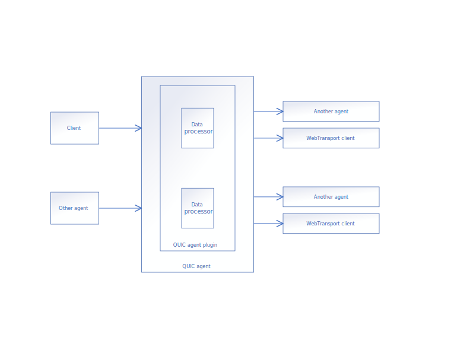

# Introduction
QUIC agent plays the role as a WebTransport server. It's intended to establish WebTransport connections with clients, send and receive arbitrary data to and from clients. The data received from client can be piped to another agent for audio or video processing, or simply forward to another clients. QUIC agent plugin mechanism allows developers to process data before it's delivered to the next node.

# Dataflow
The picture below shows how data flows for a single publication when QUIC agent plugin is enabled.

# Development
To develop a QUIC agent plugin, please implement the interface defined in `source/agent/addons/quic/plugins/QuicAgentPluginInterface.h` and compile your code as a shared library. It's highly recommend to compile your plugin with the same toolchain as OWT conference server, although sometimes it works even they are compiled with different toolchains.

# Deployment
To deploy your plugin to a QUIC agent, please update the value of `pluginPath` in QUIC agent's agent.toml. It will take effect next time QUIC agent boots.